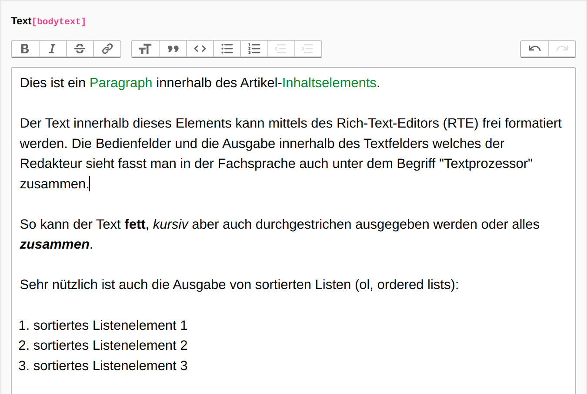

.. include:: /Includes.rst.txt

.. _introduction:

============
Introduction
============

.. _what-it-does:

What does it do?
================

The extension `trix` is incorporating the Trix-Editor into TYPO3.
It is based upon the `rte_ckeditor` and has similarities with it in terms of the configuration.

Trix is by its design much more simpler to configure and extend than CKEditor.
No quirks are needed to inject custom styling to the backend editor.
No complex configurations are needed.

Trix keeps things simple for the editor by reducing its ability to style too much
things which will eventually break in the frontend anyways (everyone experienced it - sigh).

   Editing a the bodytext of a text content type.

History
=======

Trix was initially developed for the Ruby on Rails framework as an rich
text editor integration named `ActionText`.

Trix uses a different approach like other WYSIWYG HTML editors by
using the browser API do manipulate editor inputs by treating the contenteditable
as an I/O device:

"[...] when input makes its way to the editor, Trix converts that input into an editing
operation on its internal document model, then re-renders that document back into the editor.
This gives Trix complete control over what happens after every keystroke, and avoids the need
to use execCommand at all."

Checkout https://edgeguides.rubyonrails.org/action_text_overview.html to learn more.

.. _features:

Features
========

This extension incorporates the stand Trix-Editor functionality into the TYPO3 backend.
However, the attachment functionality has been disabled as its deemed unnecessary for
most use cases.

Plugins are not necessary within Trix. If you choose to use Trix instead of CKEditor
you want the simplicity of it and the ease of use for the users.

A list of functions:

* Bold, italic, strike-through text formats (strong, em, del)
* Link-Browser integration to add Typolinks with title and target attributes
* One Headline format (only one, default is h3, can be customized)
* Blockquote format
* Code view (without HTML, to remove unnecessary characters not visibile)
* Ordered and unordered list
* Ability to increase/decrease list levels
* Editing history
